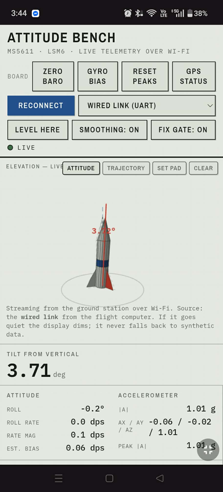
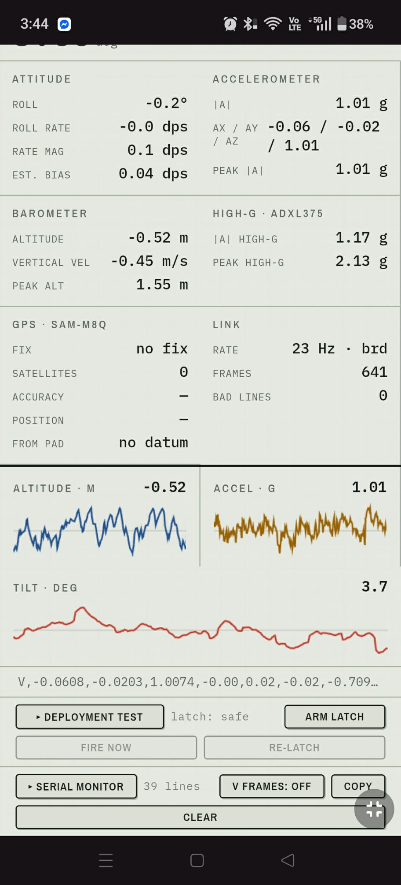
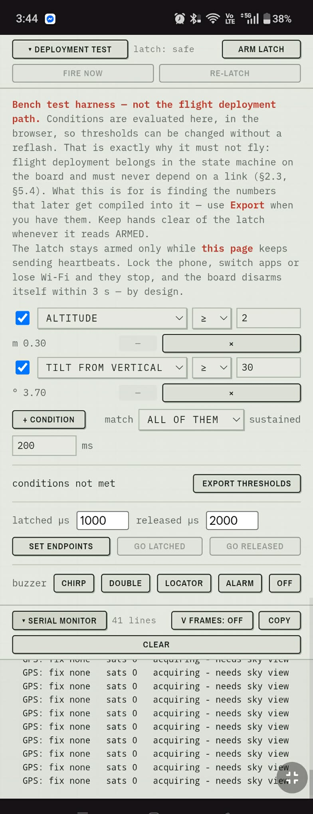

# MAARE Avionics System

Student-designed and student-researched (SRAD) flight computer for a water
pressure rocket. The vehicle is a testbed; **the avionics are the deliverable.**

Mapúa University (Intramuros).

*The viewer on real hardware. Tilt 3.11°, 1.01 g at rest, high-g peak 2.84 g,
26 Hz on the board's own clock across 15,127 frames with zero bad lines. The GPS
block reads `no fix`, `no datum` — indoors on a bench that is the correct
answer, and the pad datum is deliberately withheld rather than taken from a bad
fix (§4.5). Below the charts, the deployment test panel shows the latch
`FIRED` and refusing to fire again until it is re-latched, and the serial
monitor shows the fire sequence as the board logged it.*

*The same viewer on a phone, served by the ground station over its own Wi-Fi.
Left: the board controls live, and the source selector reading `Wired link
(UART)` — what the station is actually running, read from `/health`. Centre:
live readouts at 23 Hz on the board's clock with zero bad lines, and the latch
reading `safe` as the **board** reports it. Right: the deployment panel, with
the console showing messages the flight computer sent down the wire.*

---

## Status: v0.3.1 — work in progress

Early. **All four I²C sensors are on the flight computer and confirmed
working** and the ground segment works on synthetic data. Everything else in this repository is **design
intent, not built hardware.**

| Item | State |
|---|---|
| MS5611 barometer | Wired to the flight Pico, reading |
| MinIMU-9 v6 board | Wired; LSM6DSO (accel/gyro) reading. LIS3MDL magnetometer not read by the current sketch |
| ADXL375 high-g | **Wired and reading** — zero-g offset untrimmed |
| SAM-M8Q GPS | **Wired, configured, 3D fix obtained** — indoor sky view only, accuracy not yet usable |
| Bench diagnostics (`rocket_diagnostics/`) | Working on hardware, all four sensors |
| Pico W ground station + viewer | Working — **synthetic telemetry only** |
| MG90D servo latch | **Wired to GP6 and driven** — bench harness only, no flight deployment code |
| RFM95W LoRa ×2 | On the bench, not driven. A **wired UART downlink** stands in for the radio (v0.3.1) |
| Latch mechanism, collar joint | Not built — the servo drives nothing yet |
| Reed switch arming interlock | Not connected |
| LS3040 buzzer | Not connected |
| Airframe | Not built |
| `rocket_flight.ino` | **Not written** |

The design document is deliberately ahead of the hardware — that is its job.
Read it as a specification, not a description. `avionics_status_report.md`
tracks where the build has got to.

---

## What this is

A water rocket's flight envelope is hostile in the ways that matter — 20–100 g
boost, sub-second burn, ~10 second total flight, a wet landing — while carrying
no propellant hazard and no regulatory burden. Every subsystem here (deployment
state machine, static ports, telemetry link, arming interlock) transfers
unchanged to a motor-powered vehicle. The consequence of a failure is a plastic
bottle, not a motor CATO.

**Objectives:** log full-rate flight data through a complete flight;
autonomously detect apogee and actuate parachute deployment; transmit live
telemetry and act as a recovery beacon after landing; build team competency
that transfers directly to high-power rocketry.

## Start here

**[`avionics_documentation.md`](avionics_documentation.md)** — the design
document and the authority for this project. Everything else is
either a companion spec or an implementation of something it specifies. If two
documents disagree, that one wins.

## Repository layout

| Path | What it is |
|---|---|
| [`avionics_documentation.md`](avionics_documentation.md) | **Design document.** Sensors, deployment logic, radio, power, recovery, firmware, regulatory, test plan |
| [`hardware_reference.md`](hardware_reference.md) | Quick bench reference — pin map, I²C addresses, driver gotchas, bring-up order |
| [`airframe_build_spec.md`](airframe_build_spec.md) | Airframe structure, materials, dimensions, assembly sequence |
| [`avionics_status_report.md`](avionics_status_report.md) | Project status summary |
| `water_rocket_avionics_bom.xlsx` | Bill of materials — costs, suppliers, phasing, per-part justification |
| [`rocket_diagnostics/`](rocket_diagnostics/) | Bench diagnostics sketch (verified working on hardware) |
| [`servo_smoke/`](servo_smoke/) | Minimal servo sweep on GP6 — isolates a stationary latch as firmware versus wiring |
| `rocket_attitude_viewer.html` | **Live 3D viewer.** Attitude and trajectory tabs; Web Serial over USB, or SSE over Wi-Fi |
| `rocket_attitude_viewer_serial.html` | Serial-only build of the viewer — the bench path that works today |
| [`tools/checks/`](tools/checks/) | Headless checks for the ground station model and viewer builds — no hardware needed |
| [`CHANGELOG.md`](CHANGELOG.md) | What changed in each version |
| [`pico_w_ground_station/`](pico_w_ground_station/) | Ground station firmware (MicroPython) + the viewer as deployed |
| `rocket_assembly_viewer.jsx` | Interactive 3D assembly and separation-sequence visualiser |

## Hardware

*The bench stack as built: Pico H, SAM-M8Q, ADXL375, MinIMU-9 v6 and GY-63 on a
single I²C bus, with the MG90D servo latch and LS3040 buzzer beside it. The
RFM95W LoRa breakout at the front is on the board but no firmware drives it
yet — the "900MHz" silkscreen is Adafruit's label for the high-band RFM95W,
which covers the 868 MHz band this project uses. This is the breadboard
prototype; the two-deck FR4 sled of §11 is not built.*

| Subsystem | Component |
|---|---|
| Compute (flight) | Raspberry Pi Pico (RP2040), official Arduino Mbed OS core |
| Compute (ground) | Raspberry Pi Pico W, MicroPython |
| Altitude | MS5611 (GY-63) — primary altimeter and apogee trigger |
| Attitude | Pololu MinIMU-9 v6 (LSM6DSO + LIS3MDL) |
| Boost accel | Adafruit ADXL375 (±200 g) |
| Position | SparkFun SAM-M8Q (u-blox, multi-GNSS incl. QZSS) |
| Radio | 2× RFM95W (SX1276) LoRa, 868–870 MHz at ≤ +14 dBm |
| Deployment | MG90D servo, pin latch in double shear |
| Arming | Reed switch + N35 magnet |
| Power | 500 mAh 1S LiPo direct to VSYS |

~80 g, ~80–90 mA, roughly 5 hours of pad endurance.

> This is the **designed** stack. The four I²C sensors — MS5611, MinIMU-9,
> ADXL375 and SAM-M8Q — are connected; the radio, deployment hardware and
> airframe are not. See [Status](#status-v01--work-in-progress).

## What the limitations actually are

Beyond the not-yet-connected hardware above, these are the things that would
still be true once everything is wired:

- **The deployment code has never flown.** This is the principal risk and the
  deliberate trade for SRAD capability. Serious teams often fly a commercial
  altimeter as primary deployment alongside SRAD logging.
- **The tilt inhibit is specified but not implemented.** The attitude filter
  runs ground-side only and has not been ported to flight firmware.
- **Attitude filter numbers are from synthetic tests**, not flight data. They
  establish that the algorithm is correct, not that it survives a 50 g boost.
- **The gyro saturates at ±2000 dps** (~333 RPM). A spinning vehicle exceeds
  this and the attitude estimate becomes unrecoverable, not merely noisy.
- **Yaw is unobservable** without magnetometer calibration, so the
  roll-about-vertical readout drifts. Tilt is unaffected.

§14 of the design document keeps the full list.

## Five silent failure modes on this platform

Each looks like something other than what it is, which is what makes them worth
knowing before you meet them:

- The **MS5611 can report itself absent while working perfectly.** A
  zero-length I²C `endTransmission()` on Mbed cores issues a read-type
  transaction the sensor won't ACK, so detection fails on a healthy part.
- The **gyro can report every rate 4× too high** while merely looking
  "unstable." `enableDefault()` selects ±245 dps, not the ±1000 dps that the
  commonly-copied `0.035` dps/LSB constant assumes.
- The **GPS can hold a perfect fix on the ground and drop it at launch.** The
  default dynamic model assumes a ground vehicle and rejects a rocket
  trajectory as implausible. A `setDynamicModel()` that silently failed is
  indistinguishable from one that worked until you are airborne.
- The **high-g accelerometer clips 8× earlier than its data type suggests.**
  The ADXL375 is 13-bit sign-extended into `int16`, so it saturates near
  ±4095 counts, not ±32767. Saturation logic written against the integer width
  never fires at all.
- A **`3D` GPS fix says nothing about accuracy.** Measured here: a stationary
  board on a 3D fix with 5 satellites sat **238 m** from where it first locked,
  reading `3D` the whole time. Carry the receiver's own `hAcc` estimate, and
  never take a position datum from the first fix — it is the worst one of the
  session.

None of these announces itself as a configuration error. The structural response —
**read configuration back from the hardware and print it at boot** — is cheap,
and is the standing expectation for any new device on this bus.

## Safety

This vehicle is pressurised to 100 psi and deploys a parachute under stored
spring energy.

- **Arm last, disarm first.** The reed interlock exists precisely so that
  ground handling cannot fire the latch while someone's hands are in the bay.
- **Never key the LoRa transmitter without an antenna attached** — it damages
  the PA.
- Pressure-test the bulkhead in isolation, and leak-test the airframe at full
  pressure, away from anyone's face, before trusting either.
- Flight test progression is sequenced deliberately: airframe only, then
  avionics logging-only, then deployment enabled — and only after offline
  analysis confirms the apogee detector *would have* fired correctly on logged
  flights.

## Regulatory

LoRa telemetry operates at **868.000–870.000 MHz, ≤ +14 dBm (25 mW erp)** per
NTC MC 03-06-2017 (Philippine non-specific SRD allocation) — deliberately not
the US 915 MHz default. NTC MC 004-06-2026 amended SRD parameters in June 2026;
**re-check current circulars before any RF-active flight.** §12 has the detail
and is explicit that it is not authoritative.
