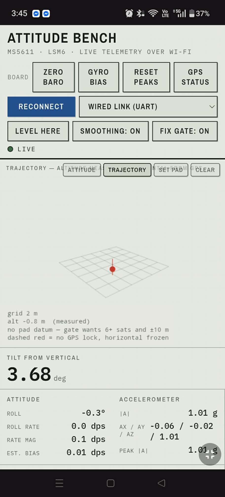

# Rocket Ground Station — Pico W

Turns a Raspberry Pi Pico W into a self-contained Wi-Fi access point that
serves the attitude viewer and streams telemetry to your phone. No router,
no internet, no app install.

**The source is the wired link by default** (v0.3.1): the flight computer's
UART runs straight into this board, standing in for the radio until the antenna
pigtails arrive. Synthetic profiles are still selectable for UI work with no
board attached. From a phone you get the whole viewer, including board commands
and the deployment test panel.

<p align="center">




</p>

*On a phone: the header and controls, the readouts, the trajectory tab (no fix
indoors, so no pad datum and a purely vertical path — as the legend says), and
the deployment panel with the board's own messages in the console.*

Design reasoning lives in [`avionics_documentation.md`](../avionics_documentation.md)
§6.5 (ground station) and §6.7 (viewer). That document is the authority if the
two ever disagree.

## Files

| File | Goes on the board as | What it is |
|---|---|---|
| `main.py` | `main.py` | AP + web server + telemetry source |
| `index.html` | `index.html` | The viewer (network-aware build) |

Total ~61 KB. The Pico W has roughly 1.4 MB of filesystem free after
MicroPython, so space is not a concern.

## Setup

1. **Flash MicroPython.** Download the `rp2-pico-w` UF2 from
   micropython.org. Hold BOOTSEL, plug in, drop the UF2 on the `RPI-RP2`
   drive. Make sure it's the **Pico W** build — the plain Pico build has no
   networking and `import network` will fail.

2. **Install Thonny** (or `mpremote`/`rshell` if you prefer). Set the
   interpreter to *MicroPython (Raspberry Pi Pico)*.

3. **Copy both files to the board.** In Thonny: open each file, then
   *File → Save as… → Raspberry Pi Pico*. Names must be exactly `main.py`
   and `index.html`.

4. **Reset the board.** `main.py` runs automatically on boot.

## Use

1. Phone Wi-Fi → join **`ROCKET-GS`**, password **`rocket12345`**
2. Browser → **http://192.168.4.1**

Android may warn that the network has no internet and offer to switch back
to mobile data — choose to stay connected. On iOS, turn off *Wi-Fi Assist*
if it keeps dropping you.

The onboard LED blinks slowly when idle and goes solid while someone is
streaming.

## What you'll see

The viewer detects it's being served over HTTP and switches from Web Serial
to Server-Sent Events automatically. The serial-mode buttons are replaced
with a **source selector**:

- **Bench wobble** (default) — gentle motion, like the board on a desk.
  This is the realistic case for checking the UI.
- **Flight profile** — a full flight on a 40 s loop: 1.6 s burn at 5 g,
  apogee near 377 m, 78 m/s peak ascent, chute descent at 6 m/s, tipping
  over after apogee. Use this to check the readouts and charts survive real
  flight numbers.
- **Hold still** — flat output, for checking noise and drift behaviour.

The flight profile deliberately hits 6 g, which clips a ±2 g accelerometer.
The producer now models that honestly: the `ax/ay/az` fields are **clipped to
±2 g**, the range the LSM6 is actually configured for, while the `hg` field
carries the true unclipped magnitude. On the flight profile the two disagree
exactly as the real hardware would — which is the entire argument for fitting
an ADXL375, and it means the high-g readout can be developed and checked
without waiting for a launch.

In bench and hold-still modes the synthetic GNSS also **cold-starts
realistically**: no fix for 3 s, then a 4-satellite ±42 m fix that converges to
9 satellites and ±2.5 m over roughly 20 s. That interval is exactly when a
naive viewer grabs its pad datum, so without it the quality gate would never be
exercised outside a real bring-up. Flight mode skips it — the vehicle has been
on the pad far longer than the compressed 40 s loop represents.

The synthetic GNSS **drops lock from launch until a few seconds past apogee**,
then reacquires at a position drifted downwind. That is what a real receiver
does, and it is the case the trajectory view has to render as an honest gap. If
the synthetic source never dropped lock, that code path would go untested until
a real flight — the worst possible time to discover it draws a fictional
curve.

## Endpoints

| Path | Purpose |
|---|---|
| `/` | The viewer |
| `/stream` | SSE telemetry, one `V,...` frame per event |
| `/health` | JSON status — mode, frame count, clients, free RAM, uptime |
| `/mode?m=bench\|flight\|still` | Switch the synthetic source |

`/health` is useful from a laptop while debugging:
`curl http://192.168.4.1/health`

## Configuration

At the top of `main.py`:

```python
SSID     = "ROCKET-GS"
PASSWORD = "rocket12345"     # WPA2 needs 8+ characters
CHANNEL  = 6
RATE_HZ  = 25
```

Change the password before any public demo — it's in plain text and anyone
who reads this repo can join your network.

## Wiring in the radio

The wire format (§6.6) is identical to what the flight sketch already emits
over serial, so the viewer needs **no changes**:

```
V,ax,ay,az,gx,gy,gz,alt,vel,millis,hg,fix,sats,lat,lon,hacc,srv,srvus
```

Keep the `millis` field when the radio goes in: it is the flight computer's own
clock, and it is the only thing that makes the arrival-time jitter of a lossy
RF link harmless — to the attitude estimate, and to the trajectory view, which
throttles its path sampling on it rather than on arrival time.

`hg` and `fix` use **−1** for "part not fitted", which is deliberately distinct
from a zero reading; `hacc` uses −1 for "no fix". Fields were appended, never
inserted, so anything parsing only the first eight or nine still works.

`hacc` is the receiver's own horizontal accuracy estimate in metres. It is what
lets the viewer refuse a pad datum from a bad fix — a 3D fix on five satellites
will happily sit hundreds of metres off, and the fix type never says so.

The architecture is producer/consumer: one task produces frames, any number of
browsers consume them.

### The wired link (v0.3.1)


Until the antenna pigtails arrive, the flight computer's UART0 is wired
straight into this board's, and that **is** the producer now — the default
source, `uart`. Every chunk off the wire goes through `tel.feed()`, which
reassembles lines across read boundaries, and `tel.accept_line()`, which
rejects anything that is not a whole frame: the tail of a line cut off when the
cable went in, board text, a baud mismatch that never produces a newline. Only
whole frames reach `set_line()`, and so a browser.

| Flight Pico | | Pico W | |
|---|---|---|---|
| **GP0** — UART0 TX, pin 1 | → | **GP1** — UART0 RX, pin 2 | telemetry down |
| **GP1** — UART0 RX, pin 2 | ← | **GP0** — UART0 TX, pin 1 | commands up — needed for phone control |
| **GND**, pin 3 | — | **GND**, pin 3 | required — no shared ground, no signal reference |

**Power: two setups work.**

- **Each Pico on its own USB**, nothing else between them.
- **One power bank, VSYS joined to VSYS** (pin 39 to pin 39) — the bench setup
  in use. Safe: each board's Schottky diode-ORs onto the shared rail, even if
  both are also on USB. It also satisfies the rule below automatically, since
  both boards power up together. **But move the servo's V+ from VBUS to
  VSYS.** VBUS only exists on a board whose own USB is plugged in; with the
  bank in the Pico W, the flight Pico's VBUS is dead and so is the latch. On
  VSYS it works whichever board holds the bank. Put the 220 µF across VSYS and
  GND near the servo: its inrush now sags the rail both boards and the Wi-Fi
  radio share, and a brown-out drops the phone's connection mid-test. Some
  power banks also switch off below ~100 mA of draw; if the rig dies after half
  a minute of idle, that is the bank, not the firmware.

**Never:**

- **3V3_EN is an input, not a supply.** It is the enable pin of each Pico's
  own 3.3 V regulator, pulled up to VSYS through 100 kΩ. It powers nothing.
  Tie it to VSYS and nothing changes; tie it to GND — or to the other board
  while that board is off — and that Pico switches its own 3.3 V rail off and
  appears dead.
- **Never feed one board's 3V3 into the other's VSYS.** If the second board is
  also on USB, its VSYS sits near 4.7 V, and the wire pushes that into the
  first board's 3.3 V rail — rated to 3.6 V, and shared with the RP2040 and
  every sensor on the bus.
- **Never power one board with the other off** when their UARTs are joined,
  unless there is ~1 kΩ in series with each TX. A powered board's TX idles high
  and back-feeds the unpowered one through its RX pin's protection diode.

**Sources are selected, never substituted.** `/mode?m=uart` for the wire, or
`bench` / `flight` / `still` for a synthetic profile; the viewer's selector
shows whichever the station is actually running. In `uart` mode the synthetic
model does not run at all — if it did, it would keep refreshing the freshness
stamp and a dead wire would never go stale. `/health` reports the source and a
`link` block — lines accepted, lines rejected, age of the last good line — in
every mode, so you can check the wire while looking at a synthetic profile.

### Commands from a phone

`/cmd?c=<command>` relays a board command up the wire. The page's buttons use
it; you can too, from a laptop on the network. What reaches the flight
computer is **rebuilt from an allowlist**, never forwarded as typed:

| Command | Does |
|---|---|
| `arm`, `safe` | permit / stop latch movement |
| `fire`, `latch` | withdraw / re-engage the pin (armed only) |
| `us <600-2400>` | drive to a raw pulse width (armed only) |
| `pos <a> <b>` | set latched / released pulse widths |
| `buz off\|chirp\|double\|locate\|alarm`, `beep <hz> <ms>` | buzzer |
| `z`, `b`, `r`, `g` | re-zero baro, gyro bias, reset peaks, GPS status |
| `srv`, `bz`, `hb` | servo status, buzzer status, heartbeat |

Anything else — unknown words, extra arguments, out-of-range numbers, stray
characters, a second command smuggled after an encoded newline — is refused
with a `400` and a reason. **Every** board command is refused with a `409`
while the source is synthetic.

**A `200` means the station put it on the wire, not that the board did it.**
The board's reply comes back as an `M,` line, which the station forwards to
every phone's console as an SSE `msg` event.

**Keep the latch armed by keeping the page open.** The board disarms after 3 s
without a command, and heartbeats come from the page — so locking the phone or
switching apps disarms it. That is the point.

**Set a real Wi-Fi password.** Joining this network now means being able to arm
the latch, and the default in `main.py` is public. Create `station_secret.py`
on the board:

```python
AP_PASSWORD = "something long"     # 8-63 characters
```

It is git-ignored. The station prints a warning at boot, and `/health` reports
`default_password: true`, until it exists.

**When the radio arrives, it will not be a UART.** An RFM95W is SPI. It needs a
LoRa driver that decodes the 18-byte §6.2 packet, formats a `V,...` line, and
hands it to `tel.accept_line()` — the same slot, different plumbing.

**The staleness path is already in place** — use `tel.set_line()` rather than
assigning `tel.latest`, and it works automatically. When the source stops
producing for more than `SOURCE_STALE_MS` (1 s), `/stream` stops sending data
frames and sends SSE comment lines instead; the connection stays open, and the
viewer's own 1.5 s timeout dims the readouts and counts the age of the last
frame. `/health` also reports `stale` and `source_age_ms`.

This matters more once the radio is real than it does now. Repeating the last
frame forever — which is what the stream did before — makes "radio silent" and
"rocket sitting still" produce byte-identical output, and no viewer-side timer
can tell them apart, because frames keep arriving on time. The fix has to be
here, at the source, not only in the browser.

## Verified on hardware

- All routes return correct status codes and content types
- `index.html` serves byte-identical to disk (md5 match) via chunked reads
- SSE sustains 25.0 Hz with monotonic timestamps (40.6 ms mean interval)
- Three simultaneous clients each get full 25 Hz and **identical** frames,
  with the simulation still advancing at 1× — not 3×
- Flight profile physics check out: 377 m apogee, 78.5 m/s, 6.01 g peak,
  monotonic ascent
- Viewer parses and runs under both `file://` (serial) and `http://`
  (network) modes

## Mobile smoothness

Phone rendering is where this page is easiest to get wrong. These are the
things that keep it smooth — and the first things to check if stutter appears.

**Client side.** Canvas sizes are measured once and cached, not per frame.
Calling `getBoundingClientRect()` forces a synchronous layout reflow, and
reassigning `canvas.width` reallocates and clears the backing buffer; doing
either every frame across four canvases costs 480 reflows and 480
reallocations per 2 s at 60 fps, against 4 of each when sizes are re-measured
only on resize or rotation. On top of that: pixel ratio is capped at 1.5 on
touch devices (at DPR 3 a full-width canvas is ~9x the pixels, for detail
nobody can see at arm's length), render is capped at 30 fps with charts at
10 fps on mobile since telemetry only arrives at 25 Hz, DOM writes are skipped
when the formatted string is unchanged, and drawing halts entirely when the tab
is hidden.

**Server side.** Two settings:

- **Wi-Fi power management disabled** (`pm=0xa11140`). The CYW43 radio parks
  itself between packets by default. That's fine for request/response traffic
  but shows up as a stutter on a steady 25 Hz stream.
- **Nagle's algorithm disabled** on the SSE socket. Frames are ~60 bytes;
  Nagle holds a small packet until the previous is ACKed, and phones delay
  ACKs by up to ~200 ms. Together those produce exactly the intermittent
  multi-frame stall this was reported as.

If stutter appears anyway, the next things to look at are phone Wi-Fi power
saving (some Android builds throttle aggressively on networks with no internet)
and distance from the Pico W — its antenna is small.

## If something's wrong

| Symptom | Cause |
|---|---|
| `index.html is not on the board` | The viewer wasn't copied. Copy it as `index.html` and reset. |
| AP never comes up, LED keeps blinking | Plain Pico, or non-W MicroPython flashed. `import network` needs the Pico **W** build. |
| Stream stutters in multi-frame bursts | Power management or Nagle re-enabled — see above. |
| Two phones disagree | The producer is being advanced per client rather than once. See §6.5. |

## Known limits

- **Synthetic data.** Nothing here reflects a real sensor yet.
- **AP mode only.** The Pico W can't be an access point and join another
  network at the same time in this configuration.
- **Roughly 4 clients.** The Pico W's AP is fine for a small team; it isn't
  a venue-wide server.
- **No HTTPS.** Fine on an isolated field network; don't reuse the password
  anywhere that matters.
- **Phone screen sleep** will pause the stream. SSE reconnects on wake, but
  you'll have a gap in the charts.
- **Disabling Wi-Fi power management raises idle current** by roughly 20-30 mA.
  Irrelevant on a power bank; worth knowing if you ever run the ground station
  from a small cell.
